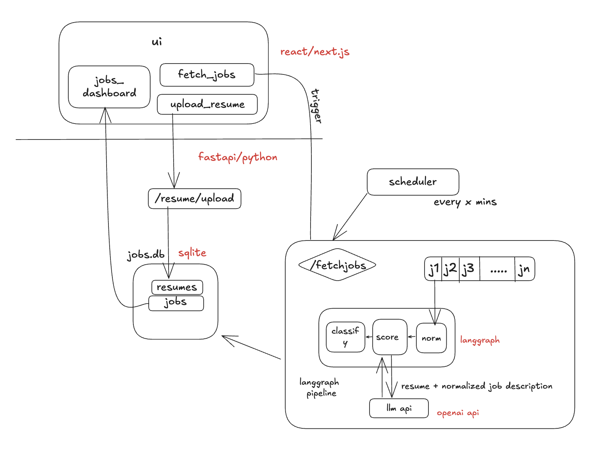
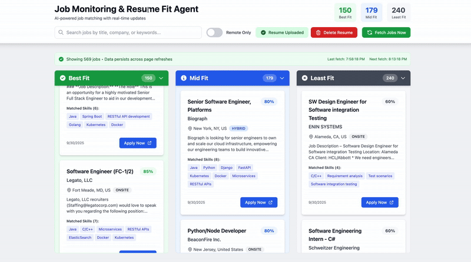

# Job Monitoring & Resume Fit Agent

An AI-powered full-stack application that automatically fetches, scores, and categorizes job postings based on how well they match your resume. Built with FastAPI (Python), React (Next.js), and LangGraph for intelligent orchestration.

  

## Features

### Core Functionality
- **Automated Job Fetching**: Fetches jobs every 5 minutes from multiple sources (LinkedIn, Indeed, or mock data)
- **Smart Resume Parsing**: Extracts skills, experiences, and education from PDF/text resumes
- **AI-Powered Scoring**: Uses embeddings and cosine similarity to match jobs with your resume (0-100 scale)
- **Intelligent Classification**: Categorizes jobs into Best Fit (>85), Mid Fit (65-85), and Least Fit (<65)
- **Real-Time Updates**: WebSocket support for instant job notifications
- **Deduplication**: Prevents duplicate job postings via ext job url.

### User Interface
- **Three-Column Dashboard**: Visual separation of Best/Mid/Least Fit jobs
- **Advanced Filters**: Search by company, keywords, or filter for remote-only positions
- **Job Cards**: Display company, role, location, work type, score, matched skills, and apply button
- **Live Statistics**: Real-time job counts by category
- **Resume Upload**: Easy drag-and-drop resume upload with instant re-scoring

### Technical Highlights
- **LangGraph Pipeline**: Fetch → Normalize → Score → Classify → Store
- **Queue System**: Async job processing with proper error handling
- **RESTful API**: Comprehensive endpoints for all operations
- **Comprehensive Tests**: Unit tests for all major components
- **Logging**: Detailed logging for debugging and monitoring


---

## 🛠️ Setup Instructions

### Prerequisites
- Python 3.9+
- npm 

### Backend Setup

1. **Navigate to backend directory**:
   ```bash
   cd backend
   ```

2. **Create virtual environment**:
   ```bash
   python -m venv venv
   source venv/bin/activate  # On Windows: venv\Scripts\activate
   ```

3. **Install dependencies**:
   ```bash
   pip install -r requirements.txt
   ```

4. **Configure environment**:

   ```
   
   Open `.env` and set your configuration:
   ```env
   OPENAI_API_KEY=your_key_here  # Optional, uses local embeddings if not set
   DATABASE_URL=sqlite:///./jobs.db
   JOB_FETCH_INTERVAL_MINUTES=5
   ```

5. **Run the backend**:
   ```bash
   python main.py
   ```
   
   Backend will start at `http://localhost:8000`
   - API docs: `http://localhost:8000/docs`
   - Alternative docs: `http://localhost:8000/redoc`

### Frontend Setup

1. **Navigate to frontend directory** (in a new terminal):
   ```bash
   cd frontend
   ```

2. **Install dependencies**:
   ```bash
   npm install
   ```

3. **Configure environment**:
   
   
   Edit `.env.local`:
   ```env
   NEXT_PUBLIC_API_URL=http://localhost:8000
   NEXT_PUBLIC_WS_URL=ws://localhost:8000
   ```

4. **Run the frontend**:
   ```bash
   npm run dev
   ```
   
   Frontend will start at `http://localhost:3000`

---

## 🎯 Usage Guide

### 1. Upload Your Resume

1. Open `http://localhost:3000` in your browser
2. Click the **"Upload Resume"** button in the header
3. Select your resume (PDF or TXT format)
4. Wait for processing confirmation

### 2. Trigger Job Fetch

- Click **"Fetch Jobs Now"** button to manually trigger job fetching
- Or wait for automatic fetching (every 5 minutes by default)

### 3. Browse Jobs

Jobs will appear in three columns:
- **Best Fit** (Green): >85% match
- **Mid Fit** (Blue): 65-85% match
- **Least Fit** (Gray): <65% match

### 4. Use Filters

- **Search**: Type keywords to search job titles, companies, or descriptions
- **Remote Toggle**: Enable to show only remote positions
- **Job Cards**: Click "Apply Now" to visit the job posting

### 5. Real-Time Updates

New jobs automatically appear as they're processed .

---

## 🔧 API Endpoints

### Jobs
- `GET /api/jobs` - Get all jobs with optional filters
  - Query params: `label`, `company`, `remote_only`, `search`, `limit`, `offset`
- `GET /api/jobs/{job_id}` - Get specific job
- `GET /api/jobs/stats/summary` - Get job statistics

### Resume
- `POST /api/resume/upload` - Upload and parse resume
- `GET /api/resume/active` - Get currently active resume

### Admin
- `POST /api/trigger-fetch` - Manually trigger job fetch
- `GET /api/` - Health check

---

## 📊 How It Works

### 1. Job Fetching
- Scheduler triggers every 15 minutes (configurable in .env)
- Can manually be triggered in UI

### 2. LangGraph Pipeline


</img>


---

### 3. Jobs Dashboard


</img>


